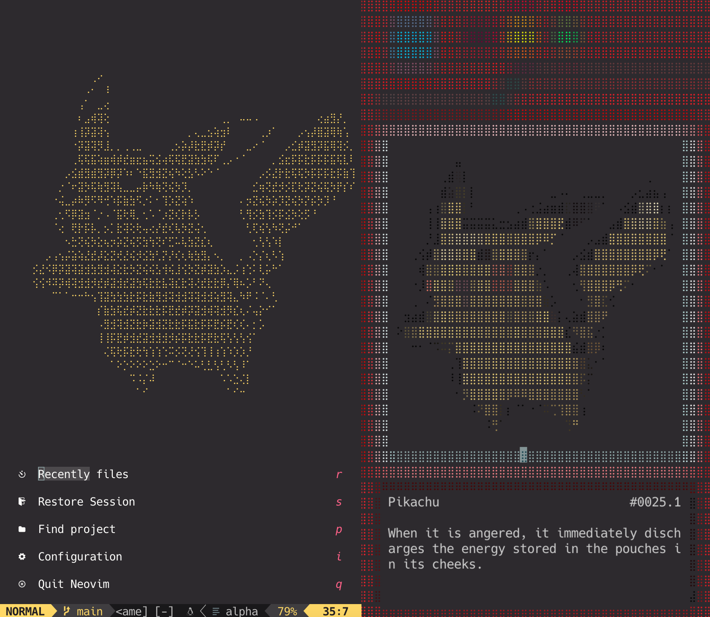
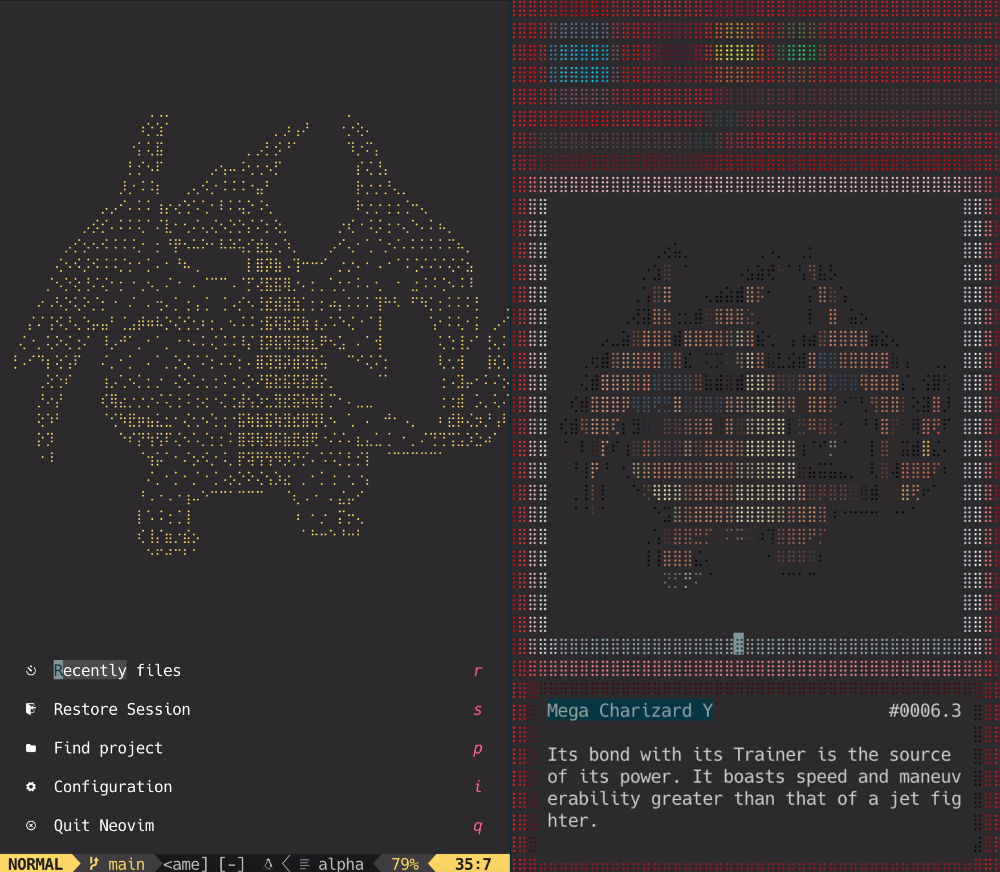
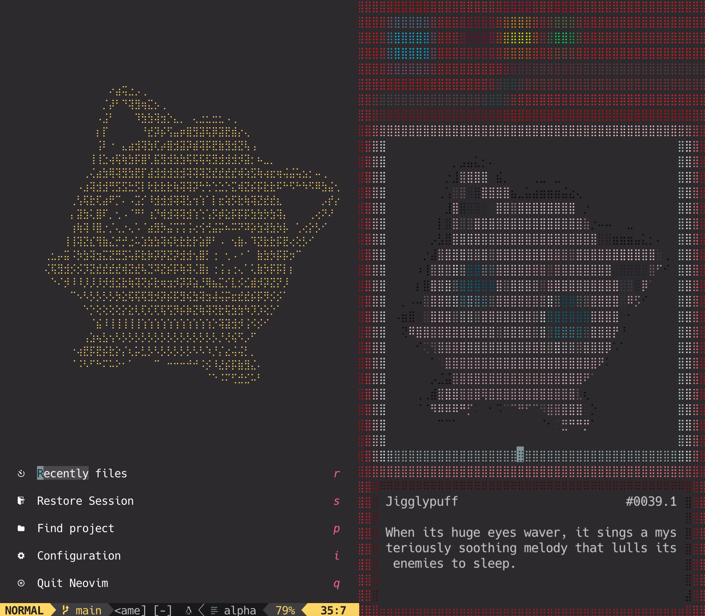

# pokemon.nvim 

`pokemon.nvim` is a `Neovim` library that displays a `Pokemon` (text art) on the startup screen header. 

Furthermore, you can use the `Pokedex` feature to access information about the current Pokemon.

## Screenshot

### Pikachu (0025)

 

### Mega Charizard Y (0006.3) 

 

### Jigglypuff (0039)

 

## Usage

### [goolord/alpha-nvim](https://github.com/goolord/alpha-nvim)

* lazy.nvim

```lua
{
    'goolord/alpha-nvim',
    event = 'VimEnter',
    config = function()
        local alpha = require('alpha')
        local dashboard = require('alpha.themes.dashboard')
        local pokemon = require('pokemon')
        pokemon.setup({
            number = 'random',
            size = 'auto',
        })
        dashboard.section.header.val = pokemon.header()
        alpha.setup(dashboard.config)
    end,
    dependencies = { { 'nvim-tree/nvim-web-devicons', 'ColaMint/pokemon.nvim' } }
}
```

### [glepnir/dashboard-nvim](https://github.com/glepnir/dashboard-nvim)

* lazy.nvim

```lua
{
    'glepnir/dashboard-nvim',
    event = 'VimEnter',
    config = function()
        local dashboard = require('dashboard')
        local pokemon = require('pokemon')
        pokemon.setup({
            number = 'random',
            size = 'auto',
        })
        dashboard.setup {
            config = {
                header = pokemon.header()
            }
        }
    end,
    dependencies = { { 'nvim-tree/nvim-web-devicons', 'ColaMint/pokemon.nvim' } }
}
```

### [mhinz/vim-startify](https://github.com/mhinz/vim-startify)

* lazy.nvim

```lua
{
    'mhinz/vim-startify',
    event = 'VimEnter',
    config = function()
        local pokemon = require('pokemon')
        pokemon.setup({
            number = 'random',
            size = 'auto',
        })
        vim.g.startify_custom_header = pokemon.header()
    end,
    dependencies = { { 'ColaMint/pokemon.nvim' } }
}
```

## Option

```lua
{ 
    -- pokemon number (format: [number]{.[forme]}). default is 'random'. 
    -- [number]: 0001 ~ 1008
    -- [forme]: 1, 2, 3, 4, ... (represents the different forme of this pokemon)
    number = 'random', -- '0001', '0006.1', '0006.2', '0006.3'
    -- header size ('small', 'large'). default is 'auto'.
    size = 'auto', 
}
```

## Command 

### `:PokemonTogglePokedex`

Toggle the floating window of `Pokedex`.

recommended keymap:

```lua
vim.api.nvim_set_keymap(
    'n',
    '<F2>',
    '<cmd>PokemonTogglePokedex<cr>',
    {
        noremap = true,
        desc = 'PokemonTogglePokedex',
    }
)
```

## Special Thanks

* https://www.pokemon.com/us/pokedex
* https://github.com/TheZoraiz/ascii-image-converter
* https://github.com/uga-rosa/utf8.nvim
